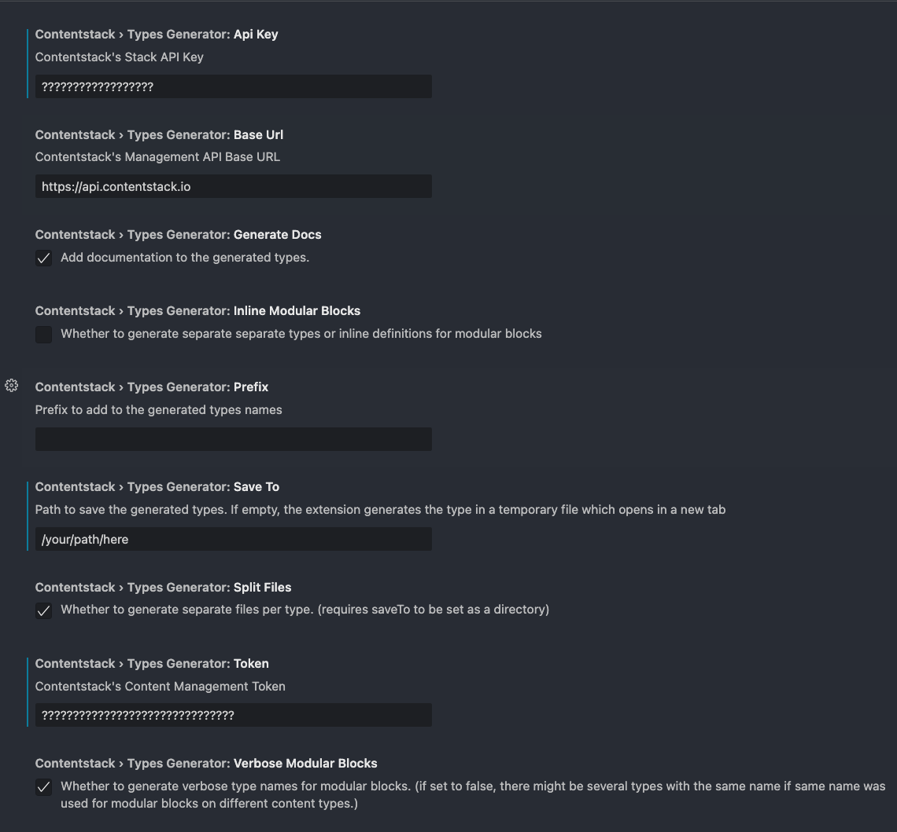

# contentstack-types-generator

This extension generates Types from a Stack in Contentstack.
It generates Types for all Content Types and Global Fields.

## Features

By default it generates the types in a temporary file and shows it in the editor so the developer can save it in the location of their choice.

## Requirements

You can provide settings using VS Code settings (see the **Extension Settings** section below).

An optional file `csconfig.json` located in the root of the workspace can be used for configuration instead. If present the extension will use its contents as opposed to the settings defined in the VS Code Settings.

Such a file looks like this:

```json
{
  "apiKey": "your-api-key",
  "baseUrl": "https://api.contentstack.io",
  "token": "your-cm-token",
  "saveTo": "/path/to/where/you/want/to/store/your/types", //optional, if omitted the extension will generate a temporary file an will open it in the editor in a new tab.
  "generateDocs": true, // whether documentation should be appended to the generated types.
  "prefix": "", // A prefix for your types, e.g. "MyTypes" would generate a "MyTypesFile" type for the File type.
  "inlineModularBlocks": true | false, // Whether you want to generate inline typing for Modular Blocks or dedicated types.
  "verboseModularBlocks": true | false, // Whether you want to make your Modular Blocks types to have a more unique Type name (from parent type) so the chances of two modular blocks in different types to be the same are reduced.
  "splitFiles": true | false // Whether you want to create dedicated files for your types.
}
```

## Extension Settings

[]

This extension contributes the following settings:

- `contentstack.typesGenerator.apiKey`: Contentstack's API KEY.
- `contentstack.typesGenerator.baseUrl`: Contentstack's API url, defaults to:`https://api.contentstack.io`.
- `contentstack.typesGenerator.token`: Contentstack's Content Management Token. Read-Only Token is recommended.
- `contentstack.typesGenerator.saveTo`: Location where you want to store your types.
- `contentstack.typesGenerator.generateDocs`: Whether to add documentation to the type definitions. Currently very basic docs and always enabled regardless of this setting.
- `contentstack.typesGenerator.prefix`: Whether you want to prepend a prefix to your Type names.
- `contentstack.typesGenerator.inlineModularBlocks`: Whether you want to generate inline typing for Modular Blocks or dedicated types..
- `contentstack.typesGenerator.verboseModularBlocks`: Whether you want to create dedicated files for your types.
- `contentstack.typesGenerator.verboseModularBlocks`: Whether you want to create dedicated files for your types.
- `contentstack.typesGenerator.baseTypeName`: Base interface name to use for the generated types. Defaults to `Module`.
- `contentstack.typesGenerator.baseContentTypeName`: Content Base interface name to use for the generated types. Extends _Module_. Defaults to `ContentBase`.
- `contentstack.typesGenerator.basePublishableContentTypeName`: Base interface name to use for the generated types. Extends _ContentBase_. Defaults to `Content`.

### Considerations

1. `apiKey`, `token`, and `baseUrl` are required.
1. When `splitFiles` is set to true, you need to provide a `saveTo` value. Additionally `saveTo` must be a valid directory name.
1. If you have a configuration file called `csconfig.json` in your workspace's root directory, that file will be used and the VS Code Settings will be ignored.

## Known Issues

This is an early version of the extension. Use it at your own discretion.
If you have any issues or questions, please email jaime@contenstack.com

## Release Notes

Users appreciate release notes as you update your extension.

### 0.0.1

Early release.

- Typescript Types generation for Content Types, Global Fields and Modular Blocks.

---

**Enjoy!**

## Screenshots

### Settings Example


